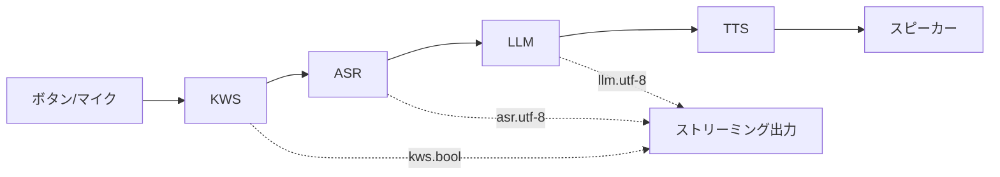

# AI Pyramid Pro - デバイス専用ツール完全ガイド

## デバイス識別情報

```bash
cat /proc/ax_proc/chip_type   # → AX650C_CHIP
cat /proc/ax_proc/board_id    # → AX650N_M5stack_8G
cat /proc/ax_proc/uid         # → ax_uid: 0x<device_unique_id>
```

## ツール一覧

| ツール | パス | 用途 | 権限 |
|-------|------|------|------|
| `ec_cli-1.0` | `/usr/local/m5stack/bin/` | EC制御 (LED/ファン/電源/LCD等) | sudo |
| `ec_proxy-1.0` | `/usr/local/m5stack/bin/` | ECデーモン (ZMQブリッジ) | root |
| `core-config` | `/usr/local/m5stack/bin/` | システム設定 (raspi-config風) | sudo |
| `axbox` | `/usr/local/m5stack/bin/` | Axeraシステムログツール (busybox風) | - |
| `fb_vo` | `/usr/local/m5stack/bin/` | ビデオ出力サンプル (HDMI) | root |
| `sample_cmm` | `/usr/local/m5stack/bin/` | CMMメモリテストツール | root |
| `AI_Pyramid_Demo.py` | `/usr/local/m5stack/bin/` | 音声アシスタントデモ | - |

## StackFlow TCP API (port 10001)

`AI_Pyramid_Demo.py` から判明した、StackFlowの完全なTCPプロトコル仕様。
OpenAI互換APIではなく、StackFlow内部の低レベルAPIに直接アクセスできる。

### プロトコル

TCP接続先: `127.0.0.1:10001`
メッセージ形式: JSON (改行区切り)

#### リクエスト形式

```json
{
  "request_id": "<uuid>",
  "work_id": "<ユニット名>",
  "action": "setup|inference|exit|trigger|pause|cmminfo|lsmode|hwinfo",
  "object": "<オブジェクトタイプ>",
  "data": { ... }
}
```

#### レスポンス形式

```json
{
  "request_id": "<uuid>",
  "work_id": "<割り当てられたwork_id>",
  "error": {"code": 0, "message": ""},
  "object": "<オブジェクトタイプ>",
  "data": { ... }
}
```

### 利用可能なユニットとsetupパラメータ

#### KWS (キーワードスポッティング / ウェイクワード)

```json
{
  "work_id": "kws",
  "action": "setup",
  "object": "kws.setup",
  "data": {
    "model": "kws-ax650",
    "response_format": "kws.bool",
    "input": ["buttons_thread", "sys.pcm"],
    "enoutput": true,
    "kws": "HI PYRAMID",
    "enwake_audio": true
  }
}
```

ウェイクワード検出時に `{"object": "kws.bool", "data": true}` を送信。

#### ASR (音声認識)

```json
{
  "work_id": "asr",
  "action": "setup",
  "object": "asr.setup",
  "data": {
    "model": "sense-voice-small-10s-ax650",
    "response_format": "asr.utf-8.stream",
    "input": ["<kws_work_id>", "sys.pcm"],
    "enoutput": true
  }
}
```

ストリーミングレスポンス: `{"object": "asr.utf-8.stream", "data": {"delta": "認識テキスト", "finish": false}}`

#### LLM (テキスト推論)

```json
{
  "work_id": "llm",
  "action": "setup",
  "object": "llm.setup",
  "data": {
    "model": "qwen2.5-0.5B-Int4-ax650",
    "response_format": "llm.utf-8.stream",
    "input": ["<kws_work_id>", "<asr_work_id>"],
    "enoutput": true,
    "max_token_len": 256,
    "prompt": "You are a helpful assistant."
  }
}
```

#### VLM (画像+テキスト推論)

```json
{
  "work_id": "vlm",
  "action": "setup",
  "object": "vlm.setup",
  "data": {
    "model": "qwen3-vl-2B-Int4-ax650",
    "response_format": "vlm.utf-8.stream",
    "input": ["vlm.utf-8"],
    "enoutput": true,
    "max_token_len": 128,
    "prompt": "You are a helpful assistant.",
    "b_video": true
  }
}
```

#### TTS (音声合成)

```json
{
  "work_id": "melotts",
  "action": "setup",
  "object": "melotts.setup",
  "data": {
    "model": "melotts-en-default-ax650",
    "response_format": "sys.pcm",
    "input": ["<kws_work_id>", "<llm_work_id>"],
    "enoutput": false
  }
}
```

#### システム問い合わせ

```json
{"work_id": "sys", "action": "cmminfo", "object": "", "data": {}}
{"work_id": "sys", "action": "lsmode",  "object": "", "data": {}}
{"work_id": "sys", "action": "hwinfo",  "object": "", "data": {}}
```

### パイプライン接続

`input` フィールドで他のユニットのwork_idを指定することで、ユニット間をパイプラインで接続できる:



デモアプリの実行: `python3 /usr/local/m5stack/bin/AI_Pyramid_Demo.py --kws "HI PYRAMID"`

## /proc/ax_proc 仮想ファイルシステム

NPU/SoC の状態を読み取れる仮想ファイル群。

### デバイス情報

```bash
cat /proc/ax_proc/chip_type       # → AX650C_CHIP
cat /proc/ax_proc/board_id        # → AX650N_M5stack_8G
cat /proc/ax_proc/uid             # → ax_uid: 0x<device_unique_id>
cat /proc/ax_proc/version         # → Ax_Version
```

### メモリ・リソース

```bash
cat /proc/ax_proc/mem_cmm_info    # CMM (NPU専用メモリ) の詳細な使用状況
cat /proc/ax_proc/os_mem          # OSメモリ情報
cat /proc/ax_proc/pool            # メモリプール情報
```

### ハードウェアモジュール

| ファイル | モジュール |
|---------|----------|
| `npu` | NPU状態 |
| `ai` | AIエンジンバージョン |
| `isp` | 画像信号プロセッサ |
| `vin` | ビデオ入力 |
| `vo` / `vo-dbg` | ビデオ出力 |
| `venc` / `vdec` | ビデオエンコード/デコード |
| `jenc` | JPEGエンコーダ |
| `ivps` | 画像ビデオ処理 |
| `ive` | 画像ビデオエンジン |
| `mipi_rx` | MIPI受信 |
| `sensor` | センサー |
| `dsp0` / `dsp1` | DSPプロセッサ |
| `dmadim` / `dmaxor` | DMAエンジン |
| `cipher` | 暗号化エンジン |
| `avs` | オーディオビデオ同期 |
| `gdc` | ジオメトリ補正 |
| `rgn` | リージョン管理 |
| `pcie` | PCIeステータス |
| `pyralite` | Pyramid Lite |
| `riscv` | RISC-Vコプロセッサ |
| `mailbox` | プロセッサ間メールボックス |
| `link_table` | リンクテーブル |
| `bw_limit` | 帯域制限 |
| `logctl` | ログ制御 |
| `kmsg` | カーネルメッセージ |

## systemd サービス

```bash
systemctl status llm-sys          # StackFlowシステム管理
systemctl status llm-llm          # LLM推論エンジン
systemctl status llm-vlm          # VLM推論エンジン
systemctl status llm-openai-api   # OpenAI互換API
systemctl status ec_proxy         # EC制御デーモン
```

再起動:
```bash
sudo systemctl restart llm-sys    # 全StackFlowを再起動（他サービスが依存）
sudo systemctl restart ec_proxy   # EC制御を再起動
```

## ZMQ Unixソケット一覧

```
/tmp/rpc.ec_prox               ← ec_proxy RPC
/tmp/llm/ec_prox.event.socket  ← ec_proxy イベント通知
/tmp/rpc.sys                   ← llm_sys RPC
/tmp/rpc.llm                   ← llm_llm RPC
/tmp/rpc.vlm                   ← llm_vlm RPC
/tmp/llm/5556.sock             ← StackFlow内部通信
```

## OTAアップデート機構

SDカード/USBメモリに `m5stack_update.config` を配置すると自動検出:

1. `block-mount.sh` がデバイス挿入を検出 → `/mnt/<dev>` にマウント
2. `update_check.sh` が `m5stack_update.config` を検索
3. 設定ファイル内の `.deb` パッケージを `apt install` で順次インストール
4. 結果をLEDで表示（緑=成功、赤=失敗）

```
# m5stack_update.config の形式
# コメント行
package1.deb
package2.deb
```

## ビデオ出力設定

`/usr/local/m5stack/vo.ini`:
- 1920x1080 @ 60fps
- HDMI DSI出力
- YUV420 セミプラナー形式
- RGBA8888 グラフィックFB

## 環境設定

`/usr/local/m5stack/bash_env.sh` を `source` するとPATHとLD_LIBRARY_PATHが設定される:
```bash
source /usr/local/m5stack/bash_env.sh
# PATH に /usr/local/m5stack/bin を追加
# LD_LIBRARY_PATH に /usr/local/m5stack/lib を追加
```
