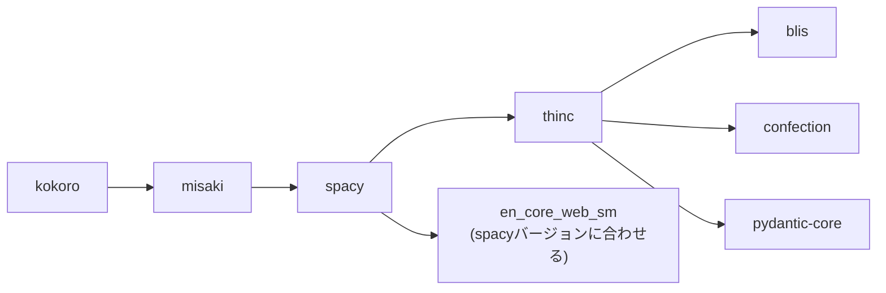
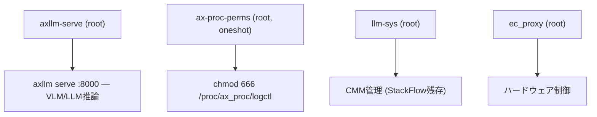

# NPU デバイス権限とサービス構成

## 概要

NPU関連デバイスを専用グループ `npu` で管理し、kokoro TTS 等を sudo なしで利用できる構成。

- **axllm serve**: root で実行（`/dev/mem` + カーネル権限の制約で非root化不可）
- **kokoro TTS**: `npu` グループ + sudoers NOPASSWD で実行（`kokoro-tts` コマンド）
- **NPU排他制御**: `kokoro-tts` が axllm を自動 stop → TTS実行 → 自動 start

## セットアップ手順

### 1. グループ・ユーザー作成

```bash
sudo groupadd npu
sudo useradd -r -s /usr/sbin/nologin -g npu -M axllm  # 将来用
sudo usermod -aG npu admin-user
# 再ログインで反映 (id コマンドで npu グループが表示されること)
```

### 2. NPUデバイス権限

```bash
# 即時適用
sudo chgrp npu /dev/npu /dev/ax_mmb_dev /dev/ax_ftc /dev/ax_cmm /dev/ax_sys /dev/ax_pool /dev/ax_base /dev/mem
sudo chmod 660 /dev/npu /dev/ax_mmb_dev /dev/ax_ftc /dev/ax_cmm /dev/ax_sys /dev/ax_pool /dev/ax_base /dev/mem
sudo chmod 666 /proc/ax_proc/logctl
```

udevルールで永続化 (`/etc/udev/rules.d/99-npu.rules`):
```
KERNEL=="npu", GROUP="npu", MODE="0660"
KERNEL=="ax_mmb_dev", GROUP="npu", MODE="0660"
KERNEL=="ax_ftc", GROUP="npu", MODE="0660"
KERNEL=="ax_cmm", GROUP="npu", MODE="0660"
KERNEL=="ax_sys", GROUP="npu", MODE="0660"
KERNEL=="ax_pool", GROUP="npu", MODE="0660"
KERNEL=="ax_base", GROUP="npu", MODE="0660"
KERNEL=="mem", GROUP="npu", MODE="0660"
```

`/proc/ax_proc/logctl` は procfs のため udev 管轄外。systemd で対応:

`/etc/systemd/system/ax-proc-perms.service`:
```ini
[Unit]
Description=Set /proc/ax_proc permissions for NPU access
After=local-fs.target

[Service]
Type=oneshot
ExecStart=/bin/chmod 666 /proc/ax_proc/logctl
RemainAfterExit=yes

[Install]
WantedBy=multi-user.target
```

```bash
sudo systemctl enable ax-proc-perms.service
```

### 3. sudoers 設定

`/etc/sudoers.d/npu-python`:
```
admin-user ALL=(root) NOPASSWD: SETENV: /usr/bin/python3.10, /usr/bin/systemctl stop axllm-serve, /usr/bin/systemctl start axllm-serve, /usr/bin/rm -f /tmp/kokoro_tts_output.wav
```

```bash
sudo chmod 440 /etc/sudoers.d/npu-python
sudo visudo -c  # 構文チェック
```

### 4. axllm-serve サービス

`/etc/systemd/system/axllm-serve.service`:
```ini
[Unit]
Description=axllm OpenAI-compatible API Server
After=network.target ax-proc-perms.service

[Service]
Type=simple
ExecStart=/usr/local/bin/axllm serve /opt/m5stack/data/qwen3-vl-2B-Int4-ax650-ctx4095/ --port 8000
Restart=always
RestartSec=3
StartLimitInterval=0

[Install]
WantedBy=multi-user.target
```

axllm は `/dev/mem` アクセスに `CAP_SYS_RAWIO` が必要だが、それだけでは不十分
（`AX_SYS_Init()` 内部の追加カーネル権限チェックで SIGBUS）。**root で実行する。**

```bash
sudo systemctl daemon-reload
sudo systemctl enable axllm-serve
sudo systemctl start axllm-serve
```

### 5. kokoro-tts コマンド

`/usr/local/bin/kokoro-tts`:
```bash
#!/bin/bash
set -e
KOKORO_DIR=/opt/m5stack/data/kokoro.axera
TMPWAV=/tmp/kokoro_tts_output.wav
MAX_CHARS=200
DEFAULT_VOICE="$KOKORO_DIR/checkpoints/voices/jf_tebukuro.pt"
DEFAULT_LANG="j"

args=()
has_voice=false
has_lang=false
while [[ $# -gt 0 ]]; do
  case "$1" in
    --text|-t)
      shift
      text="$1"
      text=$(echo "$text" | sed -E 's|https?://[^ ]*||g')
      text=$(echo "$text" | sed -E 's/\{[^}]*\}//g')
      text=$(echo "$text" | sed -E '
        s/\*{1,3}//g;
        s/~{2}//g;
        s/`{1,3}//g;
        s/\[([^]]*)\]\([^)]*\)/\1/g;
        s/^#{1,6}\s*//g;
        s/^\s*[-*+]\s+//g;
        s/^\s*[0-9]+\.\s+//g;
        s/[<>|\\]//g;
      ')
      text=$(echo "$text" | sed -E 's/[[:space:]]+/ /g; s/^ //; s/ $//')
      # 短文パディング (15文字未満ならフィラーを追加)
      if [ ${#text} -lt 15 ]; then
        text="${text}。かな"
      fi
      # 長文トランケート
      if [ ${#text} -gt $MAX_CHARS ]; then
        text="${text:0:$MAX_CHARS}"
        last_period=$(echo "$text" | grep -ob '[。．.！？!?]' | tail -1 | cut -d: -f1)
        if [ -n "$last_period" ] && [ "$last_period" -gt $((MAX_CHARS / 2)) ]; then
          text="${text:0:$((last_period + 3))}"
        fi
      fi
      args+=(--text "$text")
      ;;
    --voice|-v)
      shift
      has_voice=true
      args+=(--voice "$1")
      ;;
    --lang|-l)
      shift
      has_lang=true
      args+=(--lang "$1")
      ;;
    *)
      args+=("$1")
      ;;
  esac
  shift
done

$has_voice || args+=(--voice "$DEFAULT_VOICE")
$has_lang || args+=(--lang "$DEFAULT_LANG")

sudo systemctl stop axllm-serve 2>/dev/null || true
sudo PYTHONPATH=/home/admin-user/.local/lib/python3.10/site-packages \
  /usr/bin/python3.10 "$KOKORO_DIR/demo_kokoro_ax.py" \
  --config "$KOKORO_DIR/checkpoints/config.json" \
  --axmodel_dir "$KOKORO_DIR/models" \
  --output "$TMPWAV" \
  "${args[@]}"
sudo systemctl start axllm-serve &
aplay "$TMPWAV"
sudo rm -f "$TMPWAV"
```

```bash
sudo chmod +x /usr/local/bin/kokoro-tts
```

テキスト前処理機能:
- **Markdown除去**: `# 見出し`, `**太字**`, `~~打消~~`, `` `code` ``, `[text](url)`, リスト記号
- **URL除去**: `https://...` パターン
- **JSON除去**: `{...}` ブロック
- **短文パディング**: 15文字未満は末尾に「。かな」を追加（モデルの短文トリミングバグ回避）
- **長文トランケート**: 200文字超は最後の句読点で切断 (`MAX_CHARS` で変更可)
- **デフォルト**: 日本語 (`j`), `jf_tebukuro` ボイス

### 6. kokoro Python依存パッケージ

```bash
# /tmp が小さい場合は先にリマウント
sudo mount -o remount,size=2G tmpfs /tmp

# 基本依存 (日本語・中国語TTS)
pip3 install --no-cache-dir pyopenjtalk "fugashi[unidic-lite]" jaconv mojimoji jieba scipy loguru cn2an ordered_set addict

# axengine (AXERA NPU Python推論)
python3 -c "from huggingface_hub import snapshot_download; snapshot_download('AXERA-TECH/PyAXEngine', local_dir='/tmp/PyAXEngine')"
pip3 install /tmp/PyAXEngine/axengine-*.whl

# misaki (G2P テキスト→音素変換) + 英語TTS用依存一式
# misaki 0.8.0 を使用 (0.9.x は未リリースの phonemizer API に依存)
sudo apt install -y espeak-ng
pip3 install --no-cache-dir --no-deps "misaki==0.8.0" espeakng_loader
pip3 install --no-cache-dir phonemizer segments num2words
pip3 install --no-cache-dir "spacy==3.7.5"
```

注意:
- `misaki[en]` を直接インストールすると PyTorch → CUDA (数百MB) を引くため、個別インストールする
- `spacy==3.7.5` は `thinc` をソースビルドするため ARM 環境で十数分かかる
- `en_core_web_sm` モデル (12.8MB) は初回実行時に自動ダウンロードされる
- 英語TTS が不要なら `espeak-ng` 以降の行は省略可

**pip 一括アップデートに注意**: `pip install --upgrade` をパッケージ単体で回すと依存グラフ全体を考慮しないため、spacy/thinc/pydantic 間で不整合が起きる。特に以下のチェーンが壊れやすい:



壊れた場合の修復:
```bash
# 整合するバージョンセットを一括指定でインストール
pip3 install --user spacy==3.8.14 thinc==8.3.13 confection==1.3.3 blis==1.3.3 pydantic pydantic-core
python3 -m spacy download en_core_web_sm  # spacyバージョンに合ったモデルを再取得
pip3 check  # 依存不整合の確認
```

## 使い方

```bash
# 最もシンプル (デフォルト: 日本語, jf_tebukuro ボイス)
kokoro-tts --text "こんにちは、今日はいい天気ですね"

# ボイス指定
kokoro-tts --text "こんにちは" --voice /opt/m5stack/data/kokoro.axera/checkpoints/voices/jm_kumo.pt

# 中国語TTS
kokoro-tts --text "你好世界" --lang z \
  --voice /opt/m5stack/data/kokoro.axera/checkpoints/voices/zf_xiaoyi.pt

# 英語TTS
kokoro-tts --text "Hello world" --lang a \
  --voice /opt/m5stack/data/kokoro.axera/checkpoints/voices/af_heart.pt
```

### パラメータ

| パラメータ | 説明 | デフォルト |
|-----------|------|-----------|
| `--text` | 読み上げテキスト | (必須) |
| `--lang` | 言語 (`j`=日本語, `z`=中国語, `a`=英語) | `j` |
| `--voice` | 声紋ファイル (.pt) | `jf_tebukuro.pt` |
| `--fade_out` | 末尾フェードアウト秒数 | 0.3 |
| `--max_len` | 最大分句長 | 96 |

### 日本語声紋ファイル

| ファイル | 性別 | 備考 |
|---------|------|------|
| `jf_tebukuro.pt` | 女性 | **デフォルト**。やや機械的な響き |
| `jf_alpha.pt` | 女性 | ニュートラル |
| `jf_gongitsune.pt` | 女性 | 「ごん狐」風 |
| `jf_nezumi.pt` | 女性 | 「ねずみの嫁入り」風 |
| `jm_kumo.pt` | 男性 | 「蜘蛛の糸」風 |

その他: 英語 (American/British) 21声、中国語 8声、ヒンディー語 4声、
スペイン語 3声、フランス語/イタリア語/ポルトガル語 各1-3声。
全リストは `ls /opt/m5stack/data/kokoro.axera/checkpoints/voices/` で確認。

## 性能

| 指標 | 値 |
|------|-----|
| 初期化時間 | ~2.5s |
| 推論 RTF | 0.29〜0.38 (約3倍速) |
| サンプルレート | 24000 Hz |
| axllm 停止→復帰 | ~15s (モデルロード含む) |

## 現在のサービス構成



## NPU排他制約

NPU (`AX_ENGINE`) は排他リソース。2プロセスからの同時アクセスは SEGV になる。

`kokoro-tts` コマンドはこれを自動管理:
1. `systemctl stop axllm-serve` → NPU解放
2. kokoro 推論実行
3. `systemctl start axllm-serve &` → バックグラウンドで復帰
4. `aplay` で音声再生（axllm ロードと並行）

## axllm + kokoro パイプライン

axllm でテキスト生成 → kokoro-tts で読み上げる、エッジ完結パイプライン:

```bash
# axllm にセリフを生成させて kokoro-tts で読み上げ
TEXT=$(curl -s http://localhost:8000/v1/chat/completions \
  -H "Content-Type: application/json" \
  -d '{"model":"AXERA-TECH/Qwen3-VL-2B-Instruct-GPTQ-Int4-C256-P3584-CTX4095",
       "messages":[{"role":"user","content":"猫が昼寝している様子を一文で描写してください。短く。"}],
       "max_tokens":64,"temperature":0.7}' \
  | python3 -c "import sys,json; r=json.load(sys.stdin); print(r['choices'][0]['message']['content'])")
kokoro-tts --text "$TEXT"
```

処理の流れ:
1. `curl` で axllm API にテキスト生成リクエスト
2. `python3` で JSON レスポンスからテキスト抽出
3. `kokoro-tts` が axllm を自動停止 → NPU で音声合成 → スピーカー再生 → axllm 自動再開

全処理がエッジデバイス (AX8850) 上で完結。外部API不要。

## トラブルシューティング

### `cannot open file /dev/mem, errno:13, Permission denied`

`/dev/mem` が `npu` グループでない:
```bash
sudo chgrp npu /dev/mem && sudo chmod 660 /dev/mem
```

### `cannot open file /dev/mem, errno:1, Operation not permitted`

`CAP_SYS_RAWIO` が不足。sudoers で NOPASSWD 設定済みの `sudo python3.10` 経由で実行する。
`setcap` はこのカーネル (5.15.73) では xattr 非対応のため使用不可。

### `Failed to open /proc/ax_proc/logctl`

書き込み権限が必要 (644 ではなく 666):
```bash
sudo chmod 666 /proc/ax_proc/logctl
```

### axllm-serve が SEGV で起動ループ

kokoro や他のNPUプロセスが残っている可能性:
```bash
ps aux | grep -E "python3|kokoro|axllm" | grep -v grep
sudo systemctl restart axllm-serve
```
