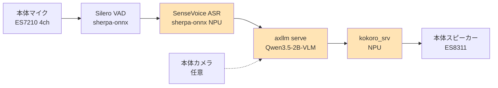

# AI Pyramid Pro おしゃべりエージェント構築案

このデバイスの NPU を活用した音声対話アシスタントの構築計画。
mic → ASR → LLM/VLM → TTS → speaker のパイプラインで、必要部品はほぼ揃っている。

## ゴール

- ローカル完結 (ネット接続不要、プライバシー保護)
- 日本語会話対応
- カメラとの連携で **「これ何？」と聞くと VLM で答える視覚アシスタント** を実現
- レイテンシ: 発話終了 → 返答開始まで **3-6 秒** が目標

## アーキテクチャ全体図



オレンジ色 = NPU使用。3つとも順次実行で問題なし (会話は本質的にシーケンシャル)。

## コンポーネント棚卸し

### ✅ 既に揃っているもの

| コンポーネント | 場所 | 備考 |
|---|---|---|
| マイク | ES7210 4ch アレイ (本体内蔵) | `hw:0,1`、`/dev/snd/pcmC0D1c` |
| スピーカー | ES8311 (本体内蔵) | `hw:0,0`、`/dev/snd/pcmC0D0p` |
| LLM/VLM サーバ | axllm-serve + Qwen3.5-2B (port 8000) | OpenAI互換 API、稼働中 |
| TTS バイナリ | `/opt/m5stack/data/kokoro.axera/cpp/install_ax650/kokoro_srv` | C++ 製、HTTP API 内蔵 |
| TTS モデル | `/opt/m5stack/data/kokoro.axera/models/` | jm_kumo (日本語) ボイス含む |
| ASR ランタイム | sherpa-onnx (pip 1.10.27) | ⚠️ CPU版、NPU活用には別途 |
| オーディオ設定doc | `docs/11_audio_devices.md` | 既存 |

### ⚠️ 追加が必要なもの

| コンポーネント | 取得方法 | サイズ目安 |
|---|---|---|
| Sherpa-onnx NPU対応版 binary | AXERA-TECH 配布 (v1.12.20 for ax650) | ~50MB |
| SenseVoice axmodel (ASR) | `huggingface.co/AXERA-TECH/SenseVoiceSmall-axmodel` | ~300MB |
| Silero VAD model | sherpa-onnx 同梱 or 単体DL | ~2MB |
| 任意: KWS モデル | sherpa-onnx ウェイクワード | ~10MB |
| 任意: pyaudio/sounddevice | `pip install sounddevice` | 小 |
| グルースクリプト | 自作 (Python ~100-200行) | - |

合計 **追加ストレージ ~400MB**

## NPU 排他制約への対処

CLAUDE.md 記載の通り、AX8850 (AX650C) の NPU は **排他リソース** (2プロセス同時アクセスで SEGV)。
ASR / LLM / TTS の3つともNPUを使うため、**同時実行は厳禁**。

### 対処方針

会話のターン構造は本質的にシーケンシャル:

```
[ユーザー発話] → ASR → [LLM思考] → TTS → [AI発話]
   静か         NPU      NPU         NPU     静か
```

各段階が排他的にNPUを使うので、**プロセス自体は常駐させ、推論呼び出しだけ順次実行** すれば良い。

### CMM (NPU メモリ) 試算

| プロセス | CMM 使用量 |
|---|---|
| axllm-serve (Qwen3.5-2B-VLM) | ~2.9 GB |
| kokoro_srv (日本語) | ~237 MB |
| SenseVoice ASR | ~300 MB (推定) |
| **合計** | **~3.4 GB / 6 GB 上限** |

✅ 同時ロード可能、メモリ上は共存OK。NPU推論だけ排他に。

## 段階的実装プラン

### Phase 1: MVP (テキスト入出力で動作確認)

NPU パイプラインの基本動作を検証。マイク/スピーカーは後回し。

```python
# voice_agent_mvp.py
import requests

def chat_loop():
    history = []
    while True:
        user_text = input("you: ")
        if not user_text: break

        history.append({"role": "user", "content": user_text})
        r = requests.post("http://localhost:8000/v1/chat/completions", json={
            "model": "qwen3.5-2b",
            "messages": history,
            "max_tokens": 200,
        })
        reply = r.json()["choices"][0]["message"]["content"]
        history.append({"role": "assistant", "content": reply})
        print(f"ai: {reply}")

        # TTS で発話
        tts = requests.post("http://localhost:28000/tts",
                            json={"text": reply, "lang": "j", "voice": "jm_kumo"})
        with open("/tmp/reply.wav", "wb") as f:
            f.write(tts.content)
        subprocess.run(["aplay", "-q", "/tmp/reply.wav"])
```

**成功条件:** テキスト入力 → LLM応答 → 日本語音声で読み上げ がループする。

### Phase 2: マイク入力 + ASR

VAD で発話検出、SenseVoice で文字起こし。

```python
# voice_agent_v2.py 追加部分
from sherpa_onnx import VoiceActivityDetector, OfflineRecognizer

vad = VoiceActivityDetector(model="silero_vad.onnx", sample_rate=16000)
asr = OfflineRecognizer.from_sense_voice(
    model="sense-voice-small/model.int8.onnx",
    tokens="sense-voice-small/tokens.txt",
    language="ja",
    provider="axera",  # ← NPU
)

def listen_once():
    """マイクから1発話キャプチャ → 文字起こし"""
    audio = capture_until_silence(vad)  # arecord/sounddevice
    result = asr.create_stream()
    result.accept_waveform(16000, audio)
    asr.decode_stream(result)
    return result.text
```

**成功条件:** マイクに向かって話す → 文字起こし → LLM → TTS のループ完成。

### Phase 3: 視覚アシスタント拡張 (このデバイス独自の強み)

カメラ画像と質問を VLM に投げる。

```python
def vision_aware_chat(user_text, camera_frame=None):
    messages = [{"role": "user", "content": []}]
    if camera_frame:
        messages[0]["content"].append({
            "type": "image_url",
            "image_url": {"url": f"data:image/jpeg;base64,{encode(camera_frame)}"}
        })
    messages[0]["content"].append({"type": "text", "text": user_text})
    # ... axllm へ
```

**例:** 「これ何？」→ カメラフレーム取得 → VLM 「茶トラの猫が日向ぼっこしています」 → TTS で発話

### Phase 4: 常時待機 (ウェイクワード)

`sherpa-onnx-keyword-spotter` で「ヘイ ピラミッド」検出 → 起動 → 上記ループ。

### Phase 5: systemd サービス化

```ini
# /etc/systemd/system/voice-agent.service
[Unit]
Description=Voice Assistant
After=axllm-serve.service kokoro-srv.service network-online.target
Requires=axllm-serve.service kokoro-srv.service

[Service]
Type=simple
ExecStart=/usr/bin/python3 /opt/voice-agent/main.py
Restart=on-failure
User=admin-user
SupplementaryGroups=audio
```

⚠️ 現状の `kokoro-tts.service` は `Type=oneshot` + `Conflicts=axllm-serve` で都度 axllm を落とす。会話用途では **kokoro_srv を常駐HTTPサーバ化した別 service** が必要 (`kokoro-srv.service` 新規作成)。

## レイテンシ予測

5秒発話 → 約30トークン応答のケース:

| 段階 | 時間 | 備考 |
|---|---|---|
| 発話終了検出 (VAD) | 200-500 ms | Silero VAD のタイムアウト |
| ASR (SenseVoice NPU) | **0.1 秒** | RTF 0.017 |
| LLM 初トークン (TTFT) | 300-500 ms | axllm prefill |
| LLM 生成 (30トークン) | 1-3 秒 | ~10-20 tok/s |
| TTS (kokoro 3秒応答) | **0.2 秒** | RTF 0.067 |
| スピーカー出力遅延 | ~50 ms | aplay buffer |
| **発話終了 → 返答開始** | **2-4.5 秒** | |

体感的にはギリギリ会話可能なレベル。VLM 画像処理が入る場合は +1-2 秒。

## 既存コンポーネントの修正必要箇所

### kokoro-tts.service の作り変え

現状:
```ini
[Service]
Type=oneshot
ExecStart=/usr/bin/python3.10 /opt/m5stack/data/kokoro.axera/demo_kokoro_ax.py
Conflicts=axllm-serve.service
```

→ 常駐HTTPサーバ版に置き換え:
```ini
# /etc/systemd/system/kokoro-srv.service
[Unit]
Description=Kokoro TTS HTTP Server
After=ax-proc-perms.service

[Service]
Type=simple
ExecStart=/opt/m5stack/data/kokoro.axera/cpp/install_ax650/kokoro_srv -p 28000 -l j
Restart=on-failure
User=admin-user

[Install]
WantedBy=multi-user.target
```

axllm との CMM 共存 (~3.1GB) は確認済み (`docs/10_tts_comparison.md` パターンA)。

### Sherpa-onnx の置き換え

```bash
# CPU 版 pip パッケージは temporary に残しつつ、NPU バイナリを追加
mkdir -p /opt/sherpa-onnx
cd /opt/sherpa-onnx
wget https://github.com/k2-fsa/sherpa-onnx/releases/download/v1.12.20/sherpa-onnx-v1.12.20-linux-aarch64-axera.tar.bz2
tar xjf sherpa-onnx-*.tar.bz2

# SenseVoice axmodel DL
huggingface-cli download AXERA-TECH/SenseVoiceSmall-axmodel \
  --local-dir /opt/m5stack/data/sensevoice
```

## 主要リスク

| リスク | 対処 |
|---|---|
| NPU 競合で SEGV | 各推論呼び出しを mutex で逐次化、または HTTP API 経由で自然に直列化 |
| kokoro 短文品質低下 (「はい」等) | LLM プロンプトで適度な長さに整形させる、または小フレーズはハードコード wav 再生 |
| マイク 4ch のチャンネル選択ミス | `arecord -D plughw:0,1 -c 1` で 1ch にダウンミックス、または ES7210 のビームフォーミング活用 |
| LLM のコンテキスト膨張 (長い会話) | history を直近 N ターンに切り詰め、または要約挿入 |
| 漢字読みエラー (G2P 限界) | LLM 出力をひらがな多めに整形、固有名詞は事前ルール変換 |
| VLM レイテンシで会話途切れ | 画像必須質問は明示トリガ (「これ見て」等) で分岐 |

## 拡張アイディア

- **マルチターン記憶**: SQLite で会話履歴を永続化、過去発話の参照
- **ペットカメラ統合**: 異常検知 (吠え声/動き) → VLM 自動分析 → TTS で発話
- **シーン認識**: 定期的にカメラフレーム取得 → 状況をささやく ("今ご飯食べてるね")
- **multilingual**: kokoro は中/英もサポート、コードスイッチング会話可能
- **キャラクター化**: システムプロンプトで口調設定 ("にゃんにゃん"風など)

## 関連ドキュメント

- `docs/10_tts_comparison.md` — TTS 選択肢比較
- `docs/11_audio_devices.md` — オーディオハードウェア詳細
- `docs/12_npu_permissions.md` — NPU 権限設定
- `docs/04_qwen35_deployment.md` — Qwen3.5 デプロイ

## 参考

- M5Stack 公式 sherpa-onnx ガイド: https://docs.m5stack.com/ja/stackflow/ai_pyramid/sherpa-onnx
- AXERA-TECH/SenseVoiceSmall-axmodel: https://huggingface.co/AXERA-TECH/SenseVoiceSmall-axmodel
- sherpa-onnx releases (axera binary): https://github.com/k2-fsa/sherpa-onnx/releases
- kokoro.axera C++ srv: `/opt/m5stack/data/kokoro.axera/cpp/install_ax650/kokoro_srv`
